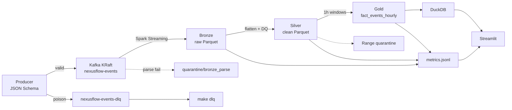
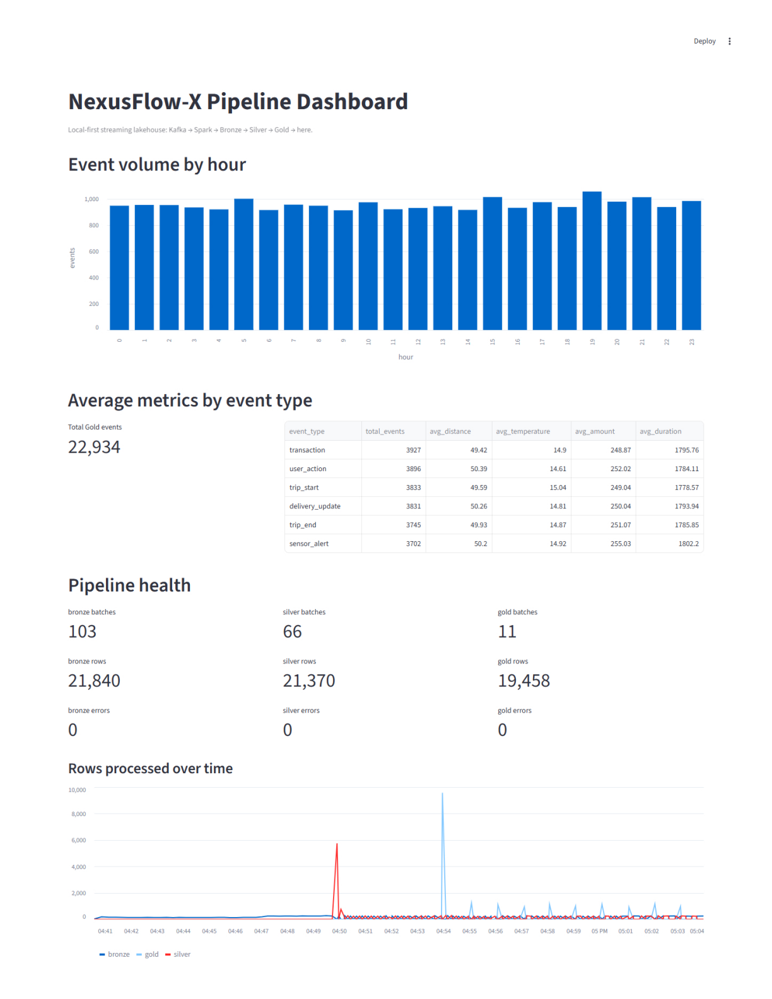

# NexusFlow-X

[](https://github.com/sauravpatel0512/NexusFlow-X/actions/workflows/ci.yml)
[](LICENSE)
[](https://python.org)
[](docker-compose.yml)
[](https://kafka.apache.org)
[](https://spark.apache.org)

Local-first, Docker-based **streaming data platform**: synthetic events → **JSON Schema gate** → **Kafka** (events + DLQ) → **Spark Structured Streaming** → **Parquet** (Bronze → Silver → Gold) → **DuckDB** + **Streamlit**, with YAML data quality and quarantine.

## Architecture



| Layer | What it proves |
|-------|----------------|
| **Contract / DLQ** | JSON Schema producer gate; poison → `nexusflow-events-dlq` (`--inject-poison`, `make dlq`) |
| **Bronze** | Kafka → Parquet with checkpoints; unparseable rows → `quarantine/bronze_parse` |
| **Silver** | Schema flatten + YAML range checks → clean path or quarantine |
| **Gold** | Hourly window aggregates for BI-style KPIs |
| **Serve** | DuckDB over Gold + Streamlit health view (0-error runs recorded) |

## Dashboard



Live local run: Gold KPIs by event type, hourly volume, and Bronze / Silver / Gold batch health (**0 errors**).

## Debugging notes (real failures)

Data engineering is mostly debugging. Three issues that actually blocked this stack—and what fixed them:

1. **Spark ↔ Kafka connector version skew** — Bronze failed after the Spark image moved to **4.1.x** while `spark-submit --packages` still pinned **`…:4.0.1`**. Symptom: connector resolution / class mismatch at job start. Fix: keep the Kafka package on the **same major.minor** as the image (`spark-sql-kafka-0-10_2.13:4.1.2` in `scripts/spark_submit_bronze.sh`).
2. **CRLF shell scripts in Linux containers** — Editing `.sh` files on Windows produced `set: pipefail: invalid option name` inside `nexus-spark`. Root cause: `\r` ending the `pipefail` token. Fix: `.gitattributes` forces `*.sh` → LF; strip with `sed -i 's/\r$//' scripts/*.sh` if a checkout is already corrupted.
3. **Spark 4 duration strings** — Gold died on `Failed to parse time string` when `maxFileAge` used `"10 min"` (space). Spark 4 wants compact forms like **`600s`** / **`10min`**. Same class of bug bites `processingTime` if you invent free-text durations.

Longer write-up: **[docs/FAILURE_NOTES.md](docs/FAILURE_NOTES.md)**. Recovery playbook: **[docs/RECOVERY.md](docs/RECOVERY.md)**.

## Quick start

1. Install [Docker](https://docs.docker.com/get-docker/) with Compose.
2. Clone the repo and run:

   ```bash
   make up    # compose up + create nexusflow-events + nexusflow-events-dlq
   # or: docker compose up -d && make topic
   ```

3. Follow **[docs/LOCAL_RUNBOOK.md](docs/LOCAL_RUNBOOK.md)** for `spark-submit` and the producer (or **[docs/DEMO_SCRIPT.md](docs/DEMO_SCRIPT.md)** for a timed walkthrough with `make gold-fast`).
4. Optional DLQ demo: `make producer ARGS='--inject-poison 5 --once'` then `make dlq`.
5. After data lands in Gold:

   ```bash
   pip install -r requirements.txt
   python analytics/gold_query.py
   python -m streamlit run analytics/dashboard.py   # localhost:8501
   ```

**Tests / lint:** `make test` · `make lint` (CI runs both). Deps pinned in `requirements.txt`. PySpark tests skip on Python 3.13+.

**Shortcuts:** `make help` — `up`, `topic`, `bronze`, `producer`, `dlq`, `silver`, `gold` / `gold-fast`, `query`, `dashboard`, `test`, `lint`. Use WSL or Git Bash on Windows if `make` is missing.

**Hooks (optional):** `pip install pre-commit && pre-commit install`

**Evidence:** [docs/validation-log.md](docs/validation-log.md) · tag [`v1.1.0`](https://github.com/sauravpatel0512/NexusFlow-X/releases/tag/v1.1.0)

## Layout

| Path | Role |
|------|------|
| `ingestion/` | Producer, JSON Schema (`event_schema.json`), contract/DLQ helpers, DQ, `quality_rules.yaml` |
| `streaming/` | Bronze, Silver, Gold Spark jobs |
| `analytics/` | DuckDB query layer and Streamlit dashboard |
| `data/` | Parquet, checkpoints, metrics (runtime, gitignored) |
| `tests/` | Unit + contract tests (pytest) |
| `scripts/` | `spark_submit_*.sh`, `create_topic.sh`, `consume_dlq.py`, `run_gold.sh` |
| `docs/` | Runbook, demo, recovery, failure notes, validation log |
